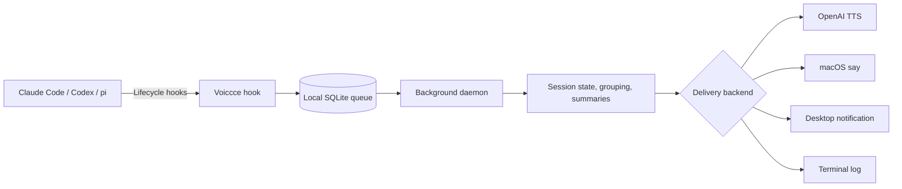

# Voiccce

<div align="center">


[](#requirements) [](https://www.python.org/)
[](#supported-agents) [](#supported-agents) [](#supported-agents)
[](#project-status) [](LICENSE)

[Install](#quick-start) | [Features](#features) | [Menu bar](#menu-bar) | [Supported agents](#supported-agents) | [How it works](#how-it-works) | [Configuration](#configuration)

</div>

---

Voiccce is the spoken status layer for parallel AI coding agents. It turns local agent lifecycle hooks into short, project-aware briefings that explain what happened, what passed or failed, and when the agent needs a decision: "Claude Code in frontend needs permission to install dependencies"; "Codex in api finished. All tests pass"; "Claude Code in payments failed while running the test suite."

Run several agents at once and let Voiccce tell you which project needs attention, finished cleanly, or failed.

## Quick start

The fastest path is the bootstrap installer. It checks for Python 3.12+ and pipx, installs whatever is missing (via Homebrew or a pip fallback), installs Voiccce, and prints the next step:

```bash
git clone https://github.com/blackbalancef/voiccce.git
cd voiccce
./install.sh
```

Or in one line, without cloning first:

```bash
curl -fsSL https://raw.githubusercontent.com/blackbalancef/voiccce/main/install.sh | bash
```

Then run the setup wizard:

```bash
voiccce setup
```

The wizard walks you through arrow-key menus:

1. **Agents** — a checkbox picker: `↑`/`↓` to move, `space` to toggle Claude Code, Codex, and/or `pi`, `a` for all, `enter` to confirm. Claude Code + Codex are pre-selected.
2. **Language** — type the language for spoken summaries, such as `English`, `Russian`, `Spanish`, or `Japanese`.
3. **Voice** — pick **OpenAI TTS** (natural cloud voice; prompts for your API key and stores it in the macOS Keychain) or the **macOS built-in voice** (offline, free, no key).
4. **Menu bar** — a yes/no prompt to install and start the optional macOS menu bar app.
5. **Stop-speaking hotkey** — when the menu bar app is enabled, pick the global shortcut (default `⌥⌘S`) that silences playback from any app, or choose Off.

<details>
<summary>Prefer manual steps? (you already have pipx)</summary>

```bash
git clone https://github.com/blackbalancef/voiccce.git
cd voiccce
pipx install --force .
voiccce setup
```

</details>

No OpenAI API key? Pick the macOS voice in the wizard, or skip the picker with:

```bash
voiccce setup --local
```

Flags skip the matching menu when you already know what you want:

- Agents: pass a target — `voiccce setup claude-code`, `codex`, `pi`, or `both` (claude-code + codex).
- Language: `--language Spanish` (or any language name you want the AI summaries translated into).
- Voice: `--openai` (cloud) or `--local` (macOS).
- Menu bar: `--menubar` or `--no-menubar`.

<details>
<summary>What does setup configure?</summary>

`voiccce setup` first asks which agents to wire, which language to speak, which voice to use (and, for OpenAI TTS, your API key), and whether to install the menu bar app — all up front. Then it: configures the voice (OpenAI TTS with voice `marin`, or macOS `say` with voice `Alex`), stores your OpenAI key in the macOS Keychain when needed, installs hooks/extensions, starts the daemon, installs and starts the optional menu bar app if you chose to, and finally sends a test notification you should hear.

If Codex was already running, restart the Codex app or `codex app-server`, then open `/hooks` in Codex and trust the Voiccce hooks.

</details>

## Requirements

- macOS, for voice playback and desktop notifications.
- Python 3.12+.
- `pipx` (`brew install pipx && pipx ensurepath`).
- Claude Code, Codex CLI, or pi.
- Optional: an OpenAI API key for the recommended voice and AI summaries. `--local` works offline with macOS `say`.

## Project status

Voiccce is currently alpha. The core workflow is usable, but CLI and configuration formats may change before v1.0.

## Features

- Parallel-session aware: notifications include the agent and project name.
- Local-first queue: hooks write sanitized events to SQLite under `~/.voiccce`.
- Grouping and deduplication: repeated lifecycle events are batched and cooled down.
- Spoken summary delivery: OpenAI TTS, macOS `say`, desktop notifications, and terminal logs.
- Runtime controls: stop speech, mute temporarily, or manage the daemon from the CLI.
- Global stop-speaking hotkey (menu bar app only): while the menu bar app runs, a system-wide shortcut (default `⌥⌘S`) silences the current announcement from any app — no Accessibility permission required.
- Optional menu bar app: quick mute, stop-speaking, language entry, the stop-hotkey picker, daemon, config, log, and spend controls.
- AI summaries: completed-session updates can be rewritten into concise spoken reports.
- AI summary translation: choose any target language name for rewritten spoken summaries.
- English and Russian template-only message text.

## Menu bar

The optional macOS menu bar companion gives quick controls without opening a terminal. `voiccce setup` offers to install and start it for you — or do it manually:

```bash
pipx inject voiccce pyobjc-framework-Cocoa
voiccce menubar-start
```

It shows estimated spend and audio stats, and offers Stop Speaking, Notification language, a Stop hotkey picker, Mute 10 min / 1 hour, Unmute, Start/Stop Daemon, Open Config, and Open Daemon Log.

### Stop-speaking hotkey

While the menu bar app is running, a global keyboard shortcut instantly stops the current voice playback — even when another app is focused, so you can silence Voiccce mid-meeting without switching windows. The default is `⌥⌘S` (Option-Command-S). It registers through Carbon, so it needs **no Accessibility or Input-Monitoring permission**, and only the chosen combination is ever captured.

Change it from the menu bar (`Stop hotkey ▸`), during `voiccce setup`, or from the CLI:

```bash
voiccce config --hotkey "ctrl+alt+cmd+."   # set a new combo (cmd, ctrl, alt, shift + a key)
voiccce config --hotkey off                 # disable it
```

```bash
voiccce stop-speaking
voiccce mute --for 10m
voiccce unmute
voiccce menubar-stop
```

## Supported agents

| Capability | Claude Code | Codex | pi |
| --- | :---: | :---: | :---: |
| Installed by `voiccce setup` (default) | Yes | Yes | - |
| Installed by explicit target | Yes | Yes | Yes |
| Task completed | Yes | Yes | Yes |
| Permission request | Yes | Yes | - |
| General attention notification | Yes | - | - |
| Task failed | Yes | - | - |
| Subagent completed | Yes | Yes | - |
| User reply interrupts current speech | Yes | - | Yes |
| Custom config/home directory | Yes | Yes | Yes |

## How it works



Hooks enqueue sanitized events locally. The daemon reads pending events, suppresses duplicates, groups related sessions, optionally generates a short summary, and sends the final notification through the configured delivery backend.

Everything Voiccce stores lives under `~/.voiccce/`, including `config.toml`, `events.sqlite3`, daemon logs, and menu bar logs.

## Configuration

The main config file is `~/.voiccce/config.toml`. Restart the daemon after manual edits.

```bash
voiccce config --language Spanish
voiccce config --voice cedar
voiccce config --voice-backend macos_say
voiccce config --voice-backend openai_tts --voice marin
voiccce stop && voiccce start
```

<details>
<summary>OpenAI key and voice backend</summary>

`voiccce setup` stores the OpenAI key in the macOS Keychain. Voiccce resolves the key from `OPENAI_API_KEY`, then `~/.voiccce/.env`, then Keychain.

```bash
voiccce secret status openai
voiccce secret set openai
voiccce secret delete openai
voiccce setup --reset-key
```

Use `voiccce setup --local` or `voiccce config --voice-backend macos_say` to run without a key.

</details>

Completed-session events can be rewritten into concise spoken explanations. The default config uses `provider = "openai"` and `model = "gpt-5.4-nano"` when credentials are available. Set `[summary].enabled = false` for template-only messages, or use `privacy_level = "metadata_only"` to summarize the already-short notification text.

## Useful commands

```bash
voiccce status
voiccce events --limit 20
voiccce test
voiccce --help
```

The legacy `agent-chime` and `agent-voice` commands are compatibility aliases for `voiccce`. To update from source: `git pull --ff-only`, reinstall with `pipx install --force .`, then restart the daemon.

## Privacy

Voiccce runs locally. Claude Code, Codex, and pi hook payloads are normalized and sanitized before storage; the SQLite database keeps metadata and the short notification summary, not the complete hook payload.

When OpenAI TTS is enabled, only the final notification sentence is sent to the speech endpoint. When AI summaries are enabled, the selected summary input is sent to the OpenAI Responses API before delivery. With the local macOS `say` backend and summaries disabled, voice delivery stays on-device.

See [SECURITY.md](SECURITY.md) for secret handling and reporting guidance.

## Development

Run tests with `python3 -m unittest discover -s tests`. Read [CONTRIBUTING.md](CONTRIBUTING.md) and [SECURITY.md](SECURITY.md) before opening changes that affect hooks, storage, delivery, or secrets.
